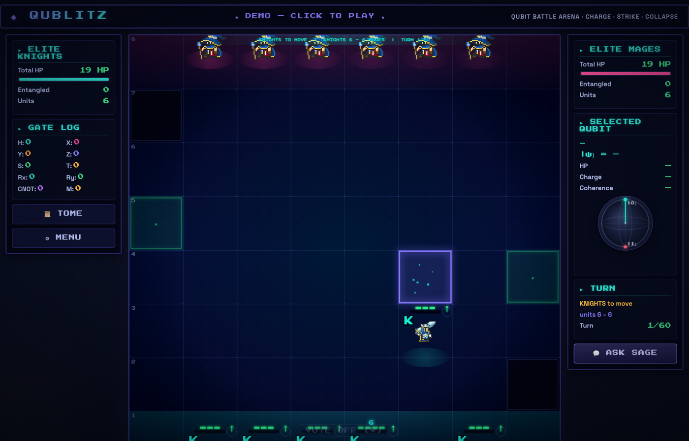

# QuBlitz — Qubit Battle Arena

QuBlitz is a quantum tactics game where every unit on the board is a **qubit**, every action is
a **quantum gate**, and combat resolves via the **Born rule**. It was built to make quantum
mechanics intuitive by making it *consequential*: you understand decoherence the moment your
charged unit relaxes and you miss the kill. The whole game is a single self-contained
`quantum_chess.html` (vanilla JS + HTML canvas) with an optional Streamlit wrapper for
deployment on the Fitzpatrick Lab platform.



---

## Quick start

**Option A — open it directly (no install):**

```bash
open quantum_chess.html        # macOS; or just double-click the file in any browser
```

The game is one file with everything embedded (sprites are base64), so Chrome or Firefox runs
it offline with zero dependencies.

**Option B — run the Streamlit wrapper:**

```bash
pip install -r requirements.txt   # streamlit>=1.35.0
streamlit run app.py
```

**Run the physics tests (Node 20+):**

```bash
node tests/qphysics.test.js       # or:  npm test
```

CI runs this same regression suite on every push (`.github/workflows/ci.yml`).

---

## Quantum mechanics primer

Each unit is a single qubit; the UI shows its live state on a Bloch sphere. The mechanics are
not flavor — they are a real (unit-tested) open-quantum-system model:

- **Born rule combat** — a unit's *charge* is `P(|1⟩)`. Attacking fires with probability equal
  to the charge. A target caught in `|1⟩` takes a **critical** hit (2 dmg); in `|0⟩`, 1 dmg.
  The attacker discharges back toward `|0⟩`.
- **Gates** — `H` builds superposition `|+⟩` (~50% charge); `X` flips to `|1⟩` (100% charge);
  `Z / S / T` are relative-phase rotations; `Rx / Ry` are tunable rotations; `MEASURE` collapses
  and stabilizes; `CNOT` entangles two units.
- **Decoherence (T₁ / T₂)** — each turn the state relaxes toward `|0⟩` by the *exact* Lindblad
  solution: charge decays as `e^(−t/T₁)`, transverse coherence as `e^(−t/T₂)` (with T₂ ≤ 2T₁).
  Leave a charged unit idle and it bleeds charge — timing is everything.
- **Relative phase is real (X-basis GUARD)** — a guarding unit is measured in the X-basis, so
  its phase decides its crit risk: `P(crit) = (1 − x)/2`. Reaching `|+⟩` (x = +1) is crit-immune;
  `|−⟩` (x = −1) is fully exposed. This makes the `Z / S / T` phase gates mechanically meaningful.
- **Entanglement (Bell pairs)** — `CNOT` creates a true 4-component `|Φ+⟩` state. Measuring one
  half collapses the partner to the correlated outcome, and the no-communication theorem is
  enforced: a local gate on one qubit never changes the other's marginal.

For the full model (the Lindblad master equation, falsifiability/T₁-recovery diagnostics, and
the cycle roadmap), see [`Project_Description.md`](Project_Description.md) and the in-game
**Physics Lab** panel.

---

## The Sage AI advisor (setup)

The Sage is an in-game quantum oracle that gives short tactical advice. It is **optional** — the
game runs fully without it (it falls back to local hard-coded tips). No API key is ever stored in
the browser. To enable the live advisor, run the bundled proxy that holds *your* Anthropic key
server-side:

```bash
ANTHROPIC_API_KEY=sk-ant-... python3 sage_proxy.py    # serves http://127.0.0.1:58744/sage
```

Then point the game at it before the page loads:

```js
window.QB_SAGE_PROXY = "http://127.0.0.1:58744/sage";
```

The Streamlit wrapper wires this automatically from `QB_SAGE_PROXY_URL` (env var) or
`st.secrets["QB_SAGE_PROXY_URL"]`, so the key lives only on the server — never in client code or
a committed file.

---

## Contributing

- **Branch naming:** feature branches off `main` (e.g. `feature/<thing>`); the canonical game is
  always `quantum_chess.html` — never edit a copy.
- **Commit messages** must follow `scope: imperative description (ticket-id)`, e.g.
  `feat: add QuBlitz_Arena stub page (QB-arena-1)` or `perf: cache mesolve (SIM-P0-1)`.
- **CI gate:** `node tests/qphysics.test.js` must pass on every commit — it extracts the real
  physics engine from the HTML and asserts the success criteria (exponential decoherence with
  R² > 0.99, T₁ recovery within 1%, Bell-pair correlation, no-communication, guard crit risk).
- **PRs** include: what changed and why, how to test locally, and a screenshot of any UI change.

---

## Research attribution

QuBlitz is developed by **David Mukuruva** (dmukuruva@gmail.com) within the **Fitzpatrick Lab,
Dartmouth College** (PI: Prof. Mattias Fitzpatrick). It is the game companion to the lab's
[qublitz](https://github.com/mvwf/qublitz) Streamlit qubit simulator
([qublitz-qubit-lab.streamlit.app](https://qublitz-qubit-lab.streamlit.app)); the QuBlitz Arena
page integrates the game onto that platform so the simulator's measured T₁/T₂ values can drive
the game's decoherence model.
